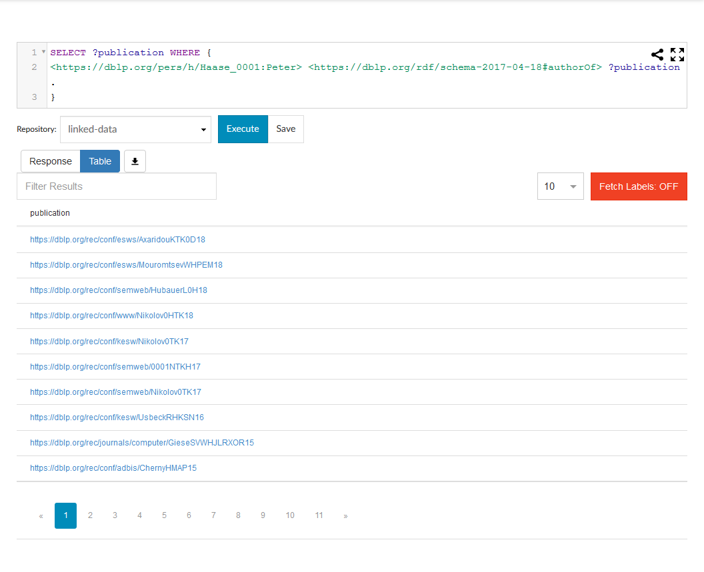
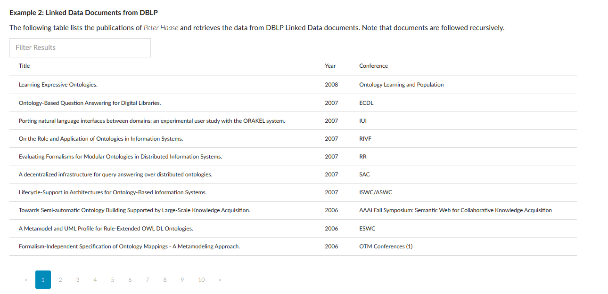
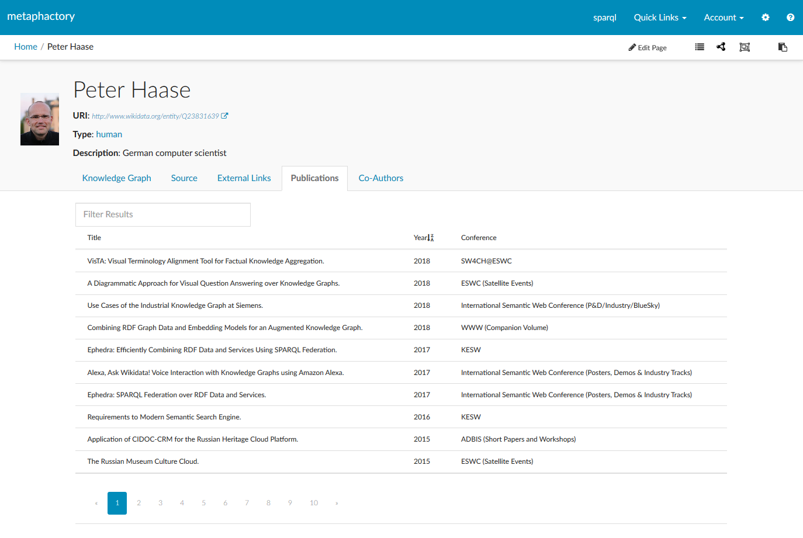

# Tutorial: Querying and displaying Linked Data documents from DBLP

In this tutorial we learn how Linked Data documents can be queried using the metaphactory
Ephedra service. Moreover, we demonstrate how such data can be used to enrich the
Wikidata knowledge graph.


## Prerequisites

* We assume familiarity with Linked Data documents and the SPARQL query language
* We assume that the reader has a running installation of the metaphactory platform
* It is assumed that the base definition files (i.e. the service wrapper) is installed. See [app project](../../ephedra-custom-linkedDataDocuments/) for details
* For the integrated example the _wikidata_ app is required to be installed in the metaphactory platform


## Introduction

[DBLP.org](https://dblp.org/) (the Digital Bibliography & Library Project) is a website that publishes bibliographical data, such as information on conferences, papers, authors etc. One of the available formats is _RDF/XML_, a representation for Linked Data documents. By navigating to a researcher's DBLP page, it is possible to retrieve an RDF representation of all his or her publications.

Thinking further about this one could come up with the idea to build an application that visualizes this data enriched with structural information from other knowledge graphs (such as Wikidata). Here the metaphactory platform is a natural fit.

In the following we describe how the respective data sources can be configured and registered in the platform, and moreover how the available visualization components can be used for integrating it into an application.


## Background

As Linked Data documents cannot typically be accessed and queried using the SPARQL language, as part of this app we provide an Ephedra service abstraction that allows the retrieval of data from Linked Data documents using the SPARQL 1.1 SERVICE feature.

The implementation is based on the RDF4J SAIL API, and requires a resolvable IRI (or more precisely a document URL) as input. While executing a query against a prepared Ephedra repository, the documents are followed using HTTP requests, potentially recursively. Note that for performance reasons certain parts of the documents are cached locally. For usage details refer to the examples below.

Once the documents are retrieved, their data is loaded into a temporary memory graph data base to make it accessible for consumption by the Ephedra engine.


## Configuration

To query Linked Data documents using Ephedra, the Linked Data repository needs to be configured, and it needs to be registered to the ephedra federation.

### Linked Data Repository configuration

The Linked Data service wrapper is implemented as an RDF4J SAIL and can thus be registered as a _Repository_ using a respective configuration on the _Repository administration_ page.

Navigate to _"/resource/Admin:Repositories"_ in your metaphactory installation, and create a new repository configuration (say '_linked-data_'). Then use the following content.

```
@prefix rdfs: <http://www.w3.org/2000/01/rdf-schema#> .
@prefix rep: <http://www.openrdf.org/config/repository#> .
@prefix sail: <http://www.openrdf.org/config/sail#> .
@prefix sr: <http://www.openrdf.org/config/repository/sail#> .
@prefix xsd: <http://www.w3.org/2001/XMLSchema#> .

[] a rep:Repository;
  rep:repositoryID "linked-data";
  rep:repositoryImpl [
      rep:repositoryType "openrdf:SailRepository";
      sr:sailImpl [
          sail:sailType "metaphacts:LinkedDataDocument"
        ]
    ];
  rdfs:label "Repository to connect to a linked data document (e.g. DBLP)." .
```

This basically instantiates a new Repository with the underlying Linked Data SAIL, which can afterwards be accessed from the Ephedra federation. For details on the configuration file please refer to the RDF4J SAIL documentation.

Notes:

* the repositoryID in the turtle representation needs to correspond to the ID of the created repository
* the newly created repository is backed by the file _config/repositories/linked-data.ttl_

In order to test the configuration, you can use the SPARQL interface to execute the following query against the '_linked-data_' repository. This will retrieve IRIs of all publications by Peter Haase.

```
PREFIX dblp: <https://dblp.org/rdf/schema-2020-07-01#>
SELECT ?publication WHERE { 
<https://dblp.org/pers/h/Haase_0001:Peter> dblp:authorOf ?publication .
}
```

The result will look similar to the following depiction. Note that this is still kind-of raw data; in the examples below we provide actual use cases.




### Ephedra configuration

The next step is to make the Ephedra federation aware of the linked data repository. For this either an existing ephedra configuration can be amended, or a new one can be created.

The most relevant part is to define a new federation member, i.e. using the _delegateRepositoryID_ and the _serviceReference_ properties. Note that the service reference points to the IRI that can be used in the SERVICE clause.

In our case we apply the following configuration snippet:

```
fedsail:member [
   ephedra:delegateRepositoryID "linked-data" ;
   ephedra:serviceReference <http://www.metaphacts.com/ontologies/platform/repository/federation#linked-data>
]
```

The Ephedra repository can be configured on the _Repository administration_ page, i.e. _"/resource/Admin:Repositories"_ in your metaphactory installation. Create a new repository configuration using the id _'ephedra-demo'_ and use the configuration below.

```
@prefix rdfs: <http://www.w3.org/2000/01/rdf-schema#> .
@prefix rep: <http://www.openrdf.org/config/repository#> .
@prefix sail: <http://www.openrdf.org/config/sail#> .
@prefix sr: <http://www.openrdf.org/config/repository/sail#> .
@prefix xsd: <http://www.w3.org/2001/XMLSchema#> .
@prefix fedsail: <http://www.openrdf.org/config/sail/federation#> .
@prefix ephedra: <http://www.metaphacts.com/ontologies/platform/ephedra#> .

[] a rep:Repository;
  rep:repositoryID "ephedra-demo";
  rep:repositoryImpl [
      rep:repositoryType "metaphacts:FederationSailRepository";
      sr:sailImpl [
          ephedra:defaultMember "default";
          sail:sailType "metaphacts:Federation";
          fedsail:member [
              ephedra:delegateRepositoryID "linked-data";
              ephedra:serviceReference <http://www.metaphacts.com/ontologies/platform/repository/federation#linked-data>
            ]
        ]
    ];
  rdfs:label "Local Ephedra federation with wikidata extensions" .
```

## Isolated Examples

Below we provide a set of examples for retrieving linked data documents.

Note that the following examples demonstrate the functionality of the Linked Data document repository wrapper, thus the queries have to be executed against the _linked-data_ repository. For federated examples refer to the next section.

### 1. Searching a single document for a resource

The following query (when executed against the _linked-data_ repository) retrieves the publication IRIs. It loads the document by following the 'subject' URL (using content negotiation) and makes the RDF graph (i.e. the outgoing statements) available for querying.

```
PREFIX dblp: <https://dblp.org/rdf/schema-2020-07-01#>
SELECT ?publication WHERE { 
	<https://dblp.org/pers/h/Haase_0001:Peter> dblp:authorOf ?publication .
}
```


### 2. Searching within a document with a given URL

The result of the query is similar to 1), however in this case we provide the document URL explicitly using the '_ld#document_' predicate:

```
PREFIX dblp: <https://dblp.org/rdf/schema-2020-07-01#>
SELECT ?subj ?publication WHERE { 
	?subj <http://www.metaphacts.com/ontologies/ld#document> <https://dblp.uni-trier.de/pers/tr/h/Haase_0001:Peter.nt> .
	?subj dblp:authorOf ?publication .
}
```

Note that the '_?subj_' variable is bound to the main resource identifier within the document, i.e. in the above case to _<https://dblp.org/pers/h/Haase_0001:Peter>_.


### 3. Following documents recursively

Sometimes it may be useful to retrieve additional information from linked documents, e.g. in our case details for a given publication IRI. This can be achieved by using the '_ld#follow_' property and pointing to the predicates that should be followed.

```
PREFIX dblp: <https://dblp.org/rdf/schema-2020-07-01#>
SELECT ?subj ?publication ?title WHERE { 
	?subj <http://www.metaphacts.com/ontologies/ld#document> <https://dblp.uni-trier.de/pers/tr/h/Haase_0001:Peter.nt> ."
	?subj <http://www.metaphacts.com/ontologies/ld#follow> dblp:authorOf . 
	?subj dblp:authorOf ?publication . 
	?publication dblp:title ?title
}
```

During the query execution the documents for each of Peter's publications are retrieved. The information is added to a combined graph and can be queried, in the example above for the 'title' of a publication.

Note that the '_ld:followSilent true_' graph pattern can optionally be used to ignore errors (e.g. if a document does not exist yielding to a HTTP 404).


### 4. Isolated example running through the Ephedra federation.

The following example shows a visualization of Peter's publications and some additional information in a table. Basically, it uses a combination of above queries and executes them against the Ephedra federation.

```
<semantic-context repository='ephedra-demo'>
      <semantic-table 
   	 query="
        PREFIX dblp: <https://dblp.org/rdf/schema-2020-07-01#>
        SELECT ?title ?year ?conference WHERE {
          BIND (<https://dblp.org/pid/h/PeterHaase1.rdf> AS ?ldDocument) .
          SERVICE <http://www.metaphacts.com/ontologies/platform/repository/federation#linked-data> {
            ?subj <http://www.metaphacts.com/ontologies/ld#document> ?ldDocument .
            ?subj <http://www.metaphacts.com/ontologies/ld#follow> dblp:authorOf . 
            ?subj dblp:authorOf ?publication .
            ?publication dblp:title ?title .
            ?publication dblp:yearOfPublication ?year .
            ?publication dblp:publishedInBook ?conference
          }
        }"
      column-configuration='[
          {"variableName": "title", "displayName": "Title"},
          {"variableName": "year", "displayName": "Year"},
          {"variableName": "conference", "displayName": "Conference"}
      ]'
      ></semantic-table>   
</semantic-context>
```

Note that above query is executed in the semantic context '_ephedra-demo_', i.e. against the Ephedra federation engine. Moreover, note that the 'linked-data' federation member is accesses through its SERVICE IRI.

The result looks similar to the following depiction.



## Integrated example

_Note: this example requires the wikidata app being installed in the metaphactory installation_. See https://github.com/metaphacts/wikidata for details.

In the following we provide an integrated and more visual example of how the data from DBLP can be combined with information from the Wikidata knowledge graph.

Let's assume we use the wikidata SPARQL endpoint as our default repository. When navigating to a wikidata resource (say '_wd:Q23831639_', which is the Wikidata identifier of Peter Haase) we can make use of the platform's templating mechanims, and for instance display additional information such as the publications and co-authors as tabs.

The result may look as follows:



We can adjust for instance the template of a human (e.g. by navigating to its template page, say _/resource/?uri=Template%3Ahttp%3A%2F%2Fwww.wikidata.org%2Fentity%2FQ5_ and editing it) and add custom tabs.

In the query we see that the DBPL ID is retrieved using the wikidata property _wdt:P2456_, moreover the URL template is used to construct the document URL. Note that in this example the syntactic wiki markup function _singleValueFromSelect_ is to be used to avoid issues in the query evaluation.

The document URL is then passed into the SERVICE which accesses the _linked-data_ repository through the ephedra federation. 


```
[[#> "Template:http://wikidata.org/ontology/Item" customTabs=true]]
  [[#*inline "customTabs"]]
  
	[[#if (ask "ASK {?? wdt:P2456 ?dblpId}")]]
		<bs-tab event-key="6" title='Publications'>
		 <semantic-context repository='ephedra-demo'>
		  <semantic-table 
		 query="
			PREFIX dblp: <https://dblp.org/rdf/schema-2020-07-01#>
			SELECT ?title ?year ?conference WHERE {
			  
			   BIND ('[[singleValueFromSelect "SELECT ?dblpUrlRdf WHERE {?? wdt:P2456 ?dblp . ?property  <http://wikiba.se/ontology#directClaim> wdt:P2456 ; wdt:P1630 ?url_template .BIND(REPLACE(?url_template, '\\$1', ?dblp) AS ?url) .  BIND (CONCAT(STR(?url), '.rdf') AS ?dblpUrlRdf) . } "]]' AS ?ldDocument) .
				
				
			  SERVICE <http://www.metaphacts.com/ontologies/platform/repository/federation#linked-data> {
				?subj <http://www.metaphacts.com/ontologies/ld#document> ?ldDocument .
				?subj <http://www.metaphacts.com/ontologies/ld#follow> dblp:authorOf . 
				?subj dblp:authorOf ?publication .
				?publication dblp:title ?title .
				?publication dblp:yearOfPublication ?year .
				?publication dblp:publishedInBook ?conference
			  }
			}"
		  column-configuration='[
			{"variableName": "title", "displayName": "Title"},
			{"variableName": "year", "displayName": "Year"},
			{"variableName": "conference", "displayName": "Conference"}
				]'
		  ></semantic-table>
		</semantic-context>
	  </bs-tab>
	[[/if]]
  [[/inline]]
[[/Template:http://wikidata.org/ontology/Item]]
```
