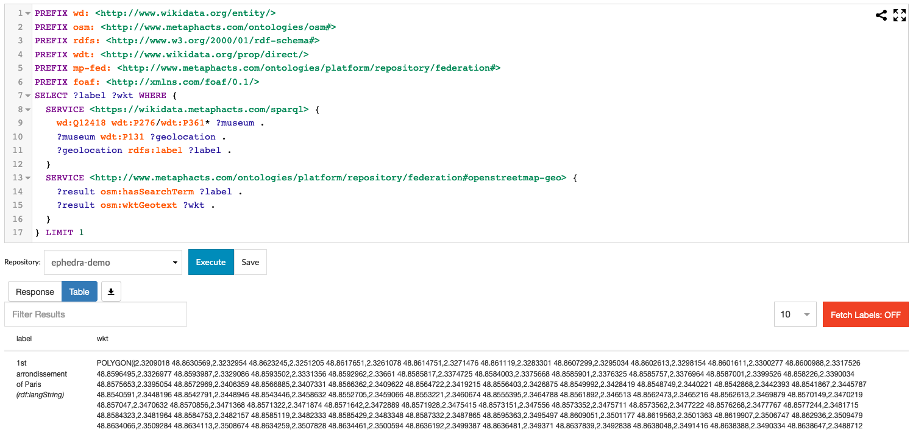
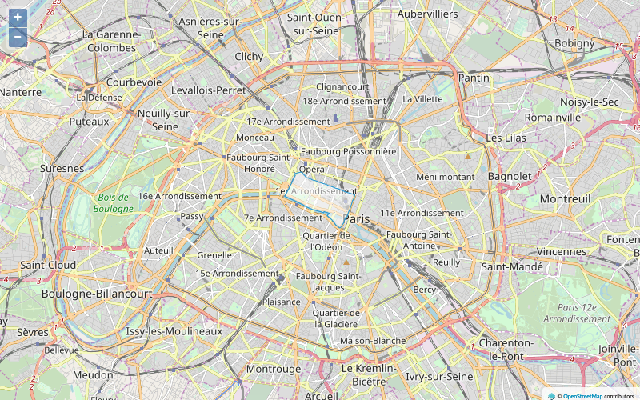

# Tutorial: Querying the OpenStreetMap REST service to retrieve geodata


In this tutorial we will show how to configure Ephedra to combine information from a local RDF repository, remote Wikidata SPARQL endpoint, and the OpenStreetMap API in a single query and display it on a map. 

See also the [app project](../../ephedra-mona-lisa/) for a complete solution to this tutorial.


## Prerequisites

* We assume familiarity with Linked Data documents and the SPARQL query language
* We assume that the reader has a running installation of the metaphactory platform


## Introduction

Our simple example use case will deal with museum artifacts and their storage locations. We will retrieve this data from the knowledge graph, combine it using Ephedra with information about geographical borders of these locations from the OpenStreetMap API, and show it as regions on a map.


After going through this post, you will be familiar with the following:

* Configuring a wrapper repository for a remote API service to enable invoking it using SPARQL.
* Configuring a hybrid federation with Ephedra including both RDF repositories and an API service.
* Integrating data from RDF databases and an API service on the fly in a single SPARQL query.
* Visualizing integrated data using the metaphactory UI components.


## Configuration

Our sample dataset contains information about people interested in the "Mona Lisa" painting. From a public RDF repository such as Wikidata we can add information about the "Mona Lisa" painting itself, such as, in which museum it is stored and in which city and district the museum is located. Finally, we can retrieve the exact borders of this region from the OpenStreetMap API and display it as an area on a map.

In order to achieve this we require some configuration for the OpenStreetMap API, particularly using the metaphactory REST servicer wrapper.

### OpenStreetMap Service configuration

A service descriptor for an Ephedra wrapper repository configures the mapping between the input and output parameters of the API and the SPARQL values and variables expressed in the SPARQL query.

In our example, we are dealing with the Nominatim OpenStreetMap search REST API (https://nominatim.openstreetmap.org/). This API expects to receive an HTTP GET query passing the parameters:

```
https://nominatim.openstreetmap.org/search?city=1st%20arrondissement%20of%20Paris&polygon_text=1&format=json&extratags=1
```
The result of this request is a JSON representation:

```
[
  {
    "place_id": "197633129",
    "licence": "Data © OpenStreetMap contributors, ODbL 1.0. https://osm.org/copyright",
    "osm_type": "relation",
    "osm_id": "20727",
    "boundingbox": [
      "48.8540519",
      "48.869929",
      "2.3209018",
      "2.3509479"
    ],
    "lat": "48.8621574",
    "lon": "2.3370411863327",
    "display_name": "1st Arrondissement, Paris, Ile-de-France, Metropolitan France, 75001, France",
    "class": "boundary",
    "type": "administrative",
    "importance": 0.764567675440502,
    "icon": "https://nominatim.openstreetmap.org/images/mapicons/poi_boundary_administrative.p.20.png",
    "geotext": "POLYGON((2.3209018 48.8630569,2.3232954 48.8623245,2.3251205 48.8617651,2.3261078 48.8614751,2.3271476 48.861119,2.3283301 48.8607299,2.3295034 48.8602613,2.3298154 48.8601611,2.3300277 48.8600988,2.3317526 48.8596495,2.3326977 48.8593987,2.3329086 48.8593502,2.3331356 48.8592962,2.33661 48.8585817,2.3374725 48.8584003,2.3375668 48.8585901,2.3376325 48.8585757,2.3376964 48.8587001,2.3399526 48.858226,2.3390034 48.8575653,2.3395054 48.8572969,2.3406359 48.8566885,2.3407331 48.8566362,2.3409622 48.8564722,2.3419215 48.8556403,2.3426875 48.8549992,2.3428419 48.8548749,2.3440221 48.8542868,2.3442393 48.8541867,2.3444256 48.854128,2.3445903 48.8540519,2.3448244 48.854272,2.3449001 48.8543437,2.3458632 48.8552705,2.3459066 48.8553221,2.3460674 48.8555395,2.3464788 48.8561892,2.346513 48.8562473,2.3469879 48.8570149,2.3470174 48.8570426,2.3470632 48.8570856,2.3471368 48.8571322,2.3471874 48.8571642,2.3472722 48.8572009,2.3475415 48.8573151,2.347556 48.8573352,2.3475711 48.8573562,2.3477222 48.8576268,2.3477767 48.8577244,2.3478433 48.8578437,2.3482107 48.8585,2.34833 48.8587206,2.3487865 48.8595363,2.3495497 48.8609051,2.3501552 48.8619903,2.3503986 48.86246,2.350666 48.8629384,2.3509479 48.8634066,2.3509284 48.8634112,2.3507828 48.863446,2.3500732 48.8636157,2.3499393 48.8636492,2.3493695 48.8637843,2.349327 48.8637938,2.3493027 48.8637991,2.3491414 48.8638384,2.3490343 48.8638662,2.348871 48.8639031,2.3486324 48.8639617,2.3476052 48.8642066,2.3466747 48.864429,2.345335 48.8647492,2.3453136 48.8647543,2.3450511 48.8648171,2.344832 48.8648695,2.3440555 48.8650551,2.3438261 48.8651106,2.343209 48.8652623,2.343086 48.8652925,2.3429407 48.8653268,2.3425634 48.8654145,2.341632 48.8656433,2.3414879 48.8656787,2.341179 48.8657499,2.3408664 48.865823,2.340686 48.8658649,2.3399876 48.8660269,2.3397724 48.8660769,2.3396487 48.866107,2.339586 48.8661228,2.3394482 48.8661575,2.3392727 48.866199,2.339059 48.8662499,2.3387301 48.8663272,2.3386695 48.8663414,2.3385836 48.8663609,2.3373502 48.8666413,2.3365563 48.8668249,2.3359347 48.8669806,2.3358835 48.8669926,2.3358688 48.866996,2.3357863 48.8670157,2.3353237 48.8671261,2.3352497 48.8671438,2.3351042 48.8671779,2.3346701 48.8672796,2.3345973 48.8672967,2.3338323 48.8674722,2.3336717 48.8675091,2.3334346 48.8675637,2.3323603 48.8678114,2.3322972 48.8678259,2.3321976 48.8678486,2.3317267 48.8679559,2.3306624 48.8681912,2.3304223 48.8683011,2.3303077 48.8683536,2.3301812 48.8684129,2.3299604 48.8685165,2.3294185 48.8689035,2.3287728 48.8693668,2.328228 48.8697576,2.3281396 48.869821,2.3279891 48.869929,2.3278218 48.8698988,2.3272461 48.869795,2.3264549 48.8696671,2.3259257 48.869581,2.3251448 48.8694624,2.3251709 48.8693956,2.3253207 48.8690129,2.3253104 48.8689979,2.3252629 48.8689284,2.3246295 48.8679975,2.3245932 48.8679442,2.3245477 48.8678826,2.3235327 48.8665097,2.3235733 48.8664962,2.3234699 48.8663867,2.3233251 48.8661764,2.3227209 48.8653912,2.3225496 48.8651726,2.3224575 48.8650518,2.3223639 48.8649306,2.3223501 48.8649134,2.322114 48.8646092,2.3215732 48.8639178,2.3212838 48.8635371,2.3209018 48.8630569))",
    "extratags": {
      "wikidata": "Q161741",
      "wikipedia": "fr:1er arrondissement de Paris"
    }
  }
]
```


From this JSON array we need to extract the information we need: the display name of the found city (_display_name_), coordinates of the bounding polygon (_geotext_), and the Wikidata ID of the returned city (_extratags / wikidata_).

(Note that according to its usage policy (https://operations.osmfoundation.org/policies/nominatim/), the Nominatim API cannot be used for production and/or heavy load usage.)

With Ephedra, we can configure a service descriptor on the _Ephedra services_ page.

Navigate to _"/resource/Admin:EphedraServices"_ in your metaphactory installation, and create a new service configuration (say '_openstreetmap-geo_'). Then use the following content.


```
PREFIX sp: <http://spinrdf.org/sp#>
PREFIX spin: <http://spinrdf.org/spin#>
PREFIX spl: <http://spinrdf.org/spl#>
PREFIX osm: <http://www.metaphacts.com/ontologies/osm#>
PREFIX geo: <http://www.opengis.net/ont/geosparql#>
PREFIX ephedra: <http://www.metaphacts.com/ontologies/platform/ephedra#>
PREFIX rdfs: <http://www.w3.org/2000/01/rdf-schema#>
PREFIX sail: <http://www.openrdf.org/config/sail#>
PREFIX : <http://www.metaphacts.com/ontologies/platform/service/custom#>

osm:openstreetmap-geo a ephedra:Service ;
	rdfs:label "A wrapper for the OpenStreetMap service." ; 
	sail:sailType "metaphacts:RESTService" ;
	ephedra:hasSPARQLPattern (
		[
			sp:subject :_result ;
			sp:predicate osm:hasSearchTerm ;
			sp:object :_city
		]
		[
			sp:subject :_result ;
			sp:predicate osm:polygonText ;
			sp:object :_polygon_text
		]
		[
			sp:subject :_result ;
			sp:predicate osm:format ;
			sp:object :_format
		]
		[
			sp:subject :_result ;
			sp:predicate osm:extratags ;
			sp:object :_extratags
		]
		[
			sp:subject :_result ;
			sp:predicate rdfs:label ;
			sp:object :_display_name
		]
		[
			sp:subject :_result ;
			sp:predicate osm:wktGeotext ;
			sp:object :_geotext
		]
		[
			sp:subject :_result ;
			sp:predicate osm:wikidataID ;
			sp:object :_wikidataID
		]
	) ;
	spin:constraint
	[
		a spl:Argument ;
		rdfs:comment "search term" ;
		spl:predicate :_city ;
		spl:valueType xsd:string
	] ;
	spin:constraint
	[
		a spl:Argument ;
		rdfs:comment "polygon text flag" ;
		spl:predicate :_polygon_text ;
		spl:defaultValue "1"^^xsd:integer ;
		spl:valueType xsd:integer
	] ;
	spin:constraint
	[
		a spl:Argument ;
		rdfs:comment "format" ;
		spl:predicate :_format ;
		spl:defaultValue "json" ;
		spl:valueType xsd:string
	] ;
	spin:constraint
	[
		a spl:Argument ;
		rdfs:comment "extra tags flag" ;
		spl:predicate :_extratags ;
		spl:defaultValue "1"^^xsd:integer ;
		spl:valueType xsd:integer
	] ;
	spin:column
	[
		a spin:Column ;
		rdfs:comment "result" ;
		spl:predicate :_result ;
		spl:valueType rdfs:Resource;
		ephedra:jsonPath "$"
	] ;
	spin:column
	[
		a spin:Column ;
		rdfs:comment "display name" ;
		spl:predicate :_display_name ;
		spl:valueType xsd:string;
		ephedra:jsonPath "$.display_name"
	] ;
	spin:column
	[
		a spin:Column ;
		rdfs:comment "geotext" ;
		spl:predicate :_geotext ;
		ephedra:jsonPath "$.geotext" ;
		spl:valueType geo:wktLiteral
	] ;
	spin:column
	[
		a spin:Column ;
		rdfs:comment "wikidataID" ;
		spl:predicate :_wikidataID ;
		ephedra:jsonPath "$.extratags.wikidata" ;
		spl:valueType xsd:string
	] .
```

This service descriptor tells Ephedra how the inputs and outputs are mapped from the SPARQL query terms to the request parameters and JSON fields of the actual REST API.

Notes: 

* the object of the property _osm:hasSearchTerm_ must carry the value for the search token (i.e. _{ ?result osm:hasSearchTerm "Paris" }_)
* the object of _osm:wikidataID_ must be an unbound variable (i.e. _{ ?result osm:wikidataID ?wikidataID }_ and the value will be extracted from the JSON structure using the JSON path expression _$.extratags.wikidata_. 
* Inputs two the REST requests are modeled as _spin:constraint_, while outputs are modeled using _spin:column_

Note that for the mapping you can use properties from an existing ontology, however, you are also free to come up with special purpose vocabulary (like the _osm:namespace_ in this example). 


### OpenStreetMap Repository Wrapper configuration

After specifying the service descriptor for the REST service, it is required to register the REST service wrapper as a repository in the platform repository manager.

Navigate to _"/resource/Admin:Repositories"_ in your metaphactory installation, and create a new repository configuration (say '_openstreetmap-geo_'). Then use the following content.
 
```
PREFIX sail: <http://www.openrdf.org/config/sail#>
PREFIX repo: <http://www.openrdf.org/config/repository#>
PREFIX repo-sail: <http://www.openrdf.org/config/repository/sail#>
PREFIX ephedra: <http://www.metaphacts.com/ontologies/platform/ephedra#>
PREFIX rdfs: <http://www.w3.org/2000/01/rdf-schema#> 
PREFIX osm: <http://www.metaphacts.com/ontologies/osm#> 

[] a repo:Repository ;
	repo:repositoryID "openstreetmap-geo" ;
	rdfs:label "Repository to test the generic service wrapper applied to OpenStreetMap." ;
	repo:repositoryImpl [
 		repo:repositoryType "openrdf:SailRepository" ;
 		repo-sail:sailImpl [
			sail:sailType "metaphacts:RESTService" ;
			ephedra:httpMethod "GET" ;
			ephedra:serviceURL "https://nominatim.openstreetmap.org/search" ;
			ephedra:httpHeader [
				ephedra:name "Accept" ;
				ephedra:value "application/json" ;
			] ;
			ephedra:implementsService osm:openstreetmap-geo 
		] 
	] .
```

Notes:

* the property _ephedra:serviceURL_ points to the REST API service URL, e.g. in our case _https://nominatim.openstreetmap.org/search_
* the property _ephedra:implementsService_ should point to the identifier of the service descriptor that we created above (i.e. in our case the prefixed URI _osm:openstreetmap-geo_)
* optionally the HTTP method and additional HTTP headers can be specified using the _ephedra:httpMethod_ amd _ephedra:httpHeader_ properties, respectively
* the newly created repository is backed by the file _config/repositories/openstreetmap-geo.ttl_
* the _repositoryID_ property needs to correspond to the repository identifier

After the repository configuration is defined and saved, the REST wrapper repository is up and running. You can test it by navigating to the SPARQL endpoint page of the metaphactory platform and sending the following query to the _openstreetmap-geo_ repository.

```
PREFIX osm: <http://www.metaphacts.com/ontologies/osm#> 
SELECT ?displayName ?wikidataID WHERE { 
	?result osm:hasSearchTerm "Paris" . 
	?result rdfs:label ?displayName . 
	?result osm:wikidataID ?wikidataID . 
}
```


### Ephedra configuration

Although now we can query the REST API with SPARQL, this does not give much added value in comparison with sending HTTP requests directly. The added value comes when the REST API data gets dynamically integrated with our knowledge graph. Ephedra achieves this using SPARQL 1.1 query federation: by using SERVICE blocks in SPARQL queries.

Ephedra federation is configured as a separate repository in the platform that combines other repositories as federation members. Each Ephedra federation has one mandatory default federation member and an arbitrary number of additional ones which are referenced by their alias URIs.

The Ephedra repository can be configured on the _Repository administration_ page, i.e. _"/resource/Admin:Repositories"_ in your metaphactory installation. 

As of the 3.5 release it is easiest to reuse the `defaultEphedra` federation and add the `openstreetmap-geo` repository as additional member:


```
ephedra:serviceMember [
   ephedra:delegateRepositoryID "openstreetmap-geo";
   ephedra:serviceReference <http://www.metaphacts.com/ontologies/platform/repository/federation#openstreetmap-geo>
];
```

For reference, a complete definition of the repository federation may look as follows:

```
@prefix ephedra: <http://www.metaphacts.com/ontologies/platform/ephedra#> .
@prefix rdfs: <http://www.w3.org/2000/01/rdf-schema#> .
@prefix rep: <http://www.openrdf.org/config/repository#> .
@prefix xsd: <http://www.w3.org/2001/XMLSchema#> .

[] a rep:Repository;
  rep:repositoryID "defaultEphedra";
  rep:repositoryImpl [
      ephedra:defaultMember "proxyToDefault";
      ephedra:serviceMember [
          ephedra:delegateRepositoryID "lookup";
          ephedra:serviceReference <http://www.metaphacts.com/ontologies/repository#lookup>
        ];
      ephedra:serviceMember [
          ephedra:delegateRepositoryID "openstreetmap-geo";
          ephedra:serviceReference <http://www.metaphacts.com/ontologies/platform/repository/federation#openstreetmap-geo>
        ];
      ephedra:writable true;
      rep:repositoryType "metaphacts:EphedraRepository"
    ];
  rdfs:label "Ephedra federation" .
```


The most relevant part is to define a new federation member, i.e. using the _delegateRepositoryID_ and the _serviceReference_ properties. Note that the service reference points to the IRI that can be used in the SERVICE clause.

Note that as of 3.5.0 metaphactory uses `defaultEphedra` as the active default repository. See [here](https://help.metaphacts.com/resource/Help:EphedraAsDefaultRepository) for details.

After creating and applying the Ephedra configuration, you can test it by executing the following example query using the SPARQL interface:

```
PREFIX wd: <http://www.wikidata.org/entity/> 
PREFIX osm: <http://www.metaphacts.com/ontologies/osm#> 
PREFIX rdfs: <http://www.w3.org/2000/01/rdf-schema#> 
PREFIX wdt: <http://www.wikidata.org/prop/direct/> 
SELECT ?label ?wkt ?label WHERE { 
  SERVICE <https://wikidata.metaphacts.com/sparql> { 
    wd:Q12418 wdt:P276/wdt:P361* ?museum . 
    ?museum wdt:P131 ?geolocation . 
    ?geolocation rdfs:label ?label . 
    FILTER (LANG(?label) = "en")
  } 
  SERVICE <http://www.metaphacts.com/ontologies/platform/repository/federation#openstreetmap-geo> { 
    ?result osm:hasSearchTerm ?label . 
    ?result osm:wktGeotext ?wkt . 
  }
} LIMIT 1
```

In the metaphactory platform's SPARQL interface the result looks as follows:




## Integrated examples

The following example query fetches the information about the location of the museum containing "Mona Lisa" from Wikidata ("Mona Lisa" is stored in Louvre, which is located in the 1st arrondissement of Paris). This data is retrieved from the remote Wikidata endpoint using the SPARQL 1.1 federation SERVICE keyword.

Furthermore, the borders of the museum location district (that make it possible to draw it on a map) is retrieved from OpenStreetMap. While this clause is also retrieved using a SERVICE keyword, this request is actually sent to a remote OpenStreetMap REST API.

The result of this query is applied in the metaphactory platform to display the location district ("1st arrondissement of Paris") on a map:


```
<semantic-map id='map-result' query='
	PREFIX wd: <http://www.wikidata.org/entity/> 
	PREFIX osm: <http://www.metaphacts.com/ontologies/osm#> 
	PREFIX rdfs: <http://www.w3.org/2000/01/rdf-schema#> 
	PREFIX wdt: <http://www.wikidata.org/prop/direct/> 
	SELECT ?link ?wkt ?label WHERE { 
		SERVICE <https://wikidata.metaphacts.com/sparql> { 
			wd:Q12418 wdt:P276/wdt:P361* ?museum . 
			?museum wdt:P131 ?geolocation . 
			?geolocation rdfs:label ?label . 
			FILTER (LANG(?label) = "en")
		} 
		SERVICE <http://www.metaphacts.com/ontologies/platform/repository/federation#openstreetmap-geo> { 
			?result osm:hasSearchTerm ?label . 
			?result osm:wktGeotext ?wkt . 
		} 
		FILTER(STRSTARTS(STR(?wkt), "POLYGON")) 
	} LIMIT 1 '
fix-zoom-level=12
tuple-template='<b>{{label.value}}</b>'>  
</semantic-map>
```

In the metaphactory platform's the resulting map looks as follows:

