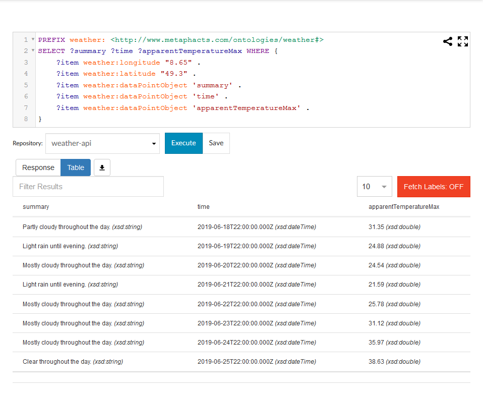
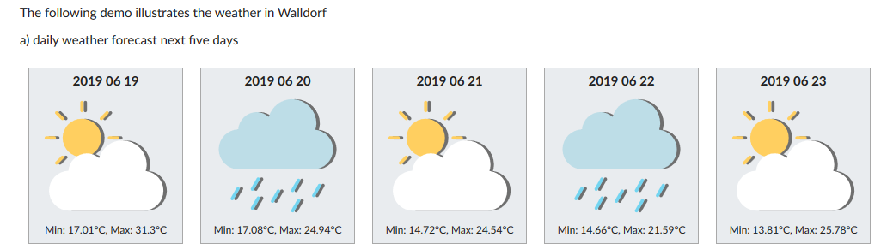
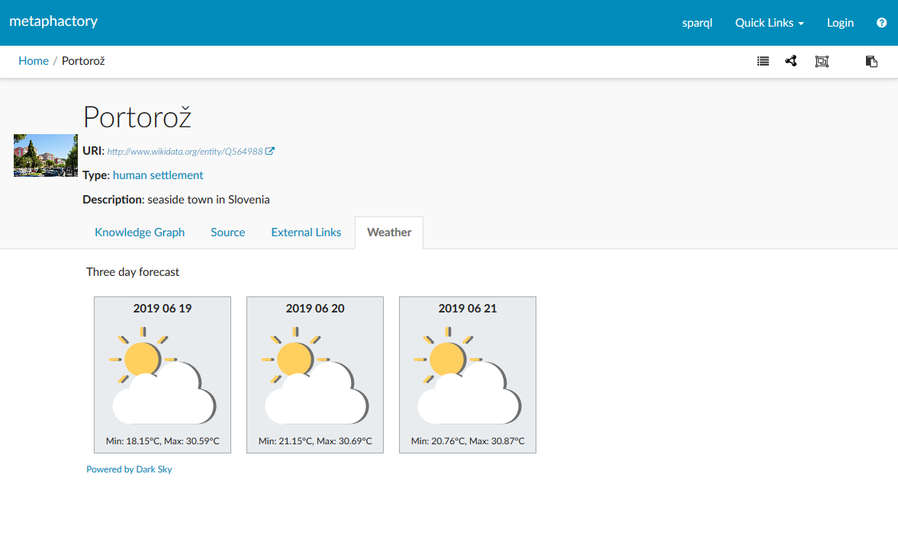

# Tutorial: Querying a weather API for a given location

**Deprecated**: this tutorial is deprecated as DarkSky has discontinued their public Weather API service. The tutorial is kept for documentation purposes only.

In this tutorial we use the geo-coordinates of a location to obtain a weather forecast. As a use-case we query the geo-coordinates from the Wikidata knowledge graph, and display the three day forecast for the corresponding location.

See the [app project](../../ephedra-custom-weatherApi/) for further details and deployment steps of the required base app.

## Prerequisites

* We assume familiarity with Linked Data documents and the SPARQL query language
* We assume that the reader has a running installation of the metaphactory platform
* It is assumed that the base definition files (i.e. the service wrapper) is installed. See [app project](../../ephedra-custom-weatherApi/) for details
* For the integrated example the _wikidata_ app is required to be installed in the metaphactory platform
* For accessing the [Dark Sky](https://darksky.net/poweredby/) API, a valid API key is required

## Introduction

In various knowledge graphs (such as for instance Wikidata) locations and places are described with geo-coordinates. Geo coordinates can be applied in various kinds of use cases, e.g. spatial queries.

Another of such use cases is the weather forecast: given the coordinates it is possible to retrieve a weather forecast for the corresponding location using a RESTful weather API.

For this tutorial we make use of the [Dark Sky](https://darksky.net/poweredby/) API.

In the following we describe the configuration and use case to display a weather forecast in the metphactory platform.


## Implementation of Weather API wrapper

In order to access the [Dark Sky](https://darksky.net/poweredby/) API as a service using the Ephedra federation, we need to provide a repository wrapper. This wrapper takes care for translating the SERVICE query into a RESTful request, and transforming the result back to an RDF representation (or more precisely tuples).

For details on the Dark Sky API usage please refer to the [API documentation](https://darksky.net/dev/docs).

The wrapper reads the SERVICE query, extracts the requested information properties (i.e. in terms of Dark Sky the supported _[data point objects](https://darksky.net/dev/docs#data-point-object)_), sends the query and finally handles the result. More implementation details can be found in the actual implementation.


## Configuration

To query the weather API using Ephedra, the weather API repository wrapper needs to be configured, and it needs to be registered to the ephedra federation.

### Weather API Repository configuration

The Dark Sky weather API service wrapper is implemented as an RDF4J SAIL and can thus be registered as a _Repository_ using a respective configuration on the _Repository administration_ page.

Navigate to _"/resource/Admin:Repositories"_ in your metaphactory installation, and create a new repository configuration (say '_weather-api_'). Then use the following content.

```
@prefix rdfs: <http://www.w3.org/2000/01/rdf-schema#> .
@prefix rep: <http://www.openrdf.org/config/repository#> .
@prefix sail: <http://www.openrdf.org/config/sail#> .
@prefix sr: <http://www.openrdf.org/config/repository/sail#> .
@prefix xsd: <http://www.w3.org/2001/XMLSchema#> .

[] a rep:Repository;
  rep:repositoryID "weather-api";
  rep:repositoryImpl [
      rep:repositoryType "openrdf:SailRepository";
      sr:sailImpl [
          sail:sailType "metaphacts:WeatherApi" ;
          <http://www.metaphacts.com/ontologies/weather-cfg#apiKey> "<YOUR API KEY HERE>";
        ]
    ];
  rdfs:label "Repository to connect to the Dark Sky weather API." .
```

Notes:

* the configuration requires a valid API key for Dark Sky. See [here](https://darksky.net/dev) for details.
* the newly created repository is backed by the file _config/repositories/weather-api.ttl_
* the _repositoryID_ property needs to correspond to the repository identifier


### Ephedra configuration

The next step is to make the Ephedra federation aware of the weather API repository wrapper. For this either an existing ephedra configuration can be amended, or a new one can be created.

The most relevant part is to define a new federation member, i.e. using the _delegateRepositoryID_ and the _serviceReference_ properties. Note that the service reference points to the IRI that can be used in the SERVICE clause.

In our case we apply the following configuration snippet:

```
fedsail:member [
   ephedra:delegateRepositoryID "weather-api" ;
   ephedra:serviceReference <http://www.metaphacts.com/ontologies/platform/repository/federation#weather-api>
]
```

The Ephedra repository can be configured on the _Repository administration_ page, i.e. _"/resource/Admin:Repositories"_ in your metaphactory installation. Create a new repository configuration using the id _'ephedra-demo'_ and use the configuration below.

```
@prefix rdfs: <http://www.w3.org/2000/01/rdf-schema#> .
@prefix rep: <http://www.openrdf.org/config/repository#> .
@prefix sail: <http://www.openrdf.org/config/sail#> .
@prefix sr: <http://www.openrdf.org/config/repository/sail#> .
@prefix xsd: <http://www.w3.org/2001/XMLSchema#> .
@prefix fedsail: <http://www.openrdf.org/config/sail/federation#> .
@prefix ephedra: <http://www.metaphacts.com/ontologies/platform/ephedra#> .

[] a rep:Repository;
  rep:repositoryID "ephedra-demo";
  rep:repositoryImpl [
      rep:repositoryType "metaphacts:FederationSailRepository";
      sr:sailImpl [
          ephedra:defaultMember "default";
          sail:sailType "metaphacts:Federation";
          fedsail:member [
              ephedra:delegateRepositoryID "weather-api";
              ephedra:serviceReference <http://www.metaphacts.com/ontologies/platform/repository/federation#weather-api>
            ]
        ]
    ];
  rdfs:label "Local Ephedra federation with wikidata extensions" .
```


## Isolated examples

In the following we provide a few isolated examples that demonstrate the capabilities of the Weather API wrapper.


### 1. Retrieving a daily weather forecast for Walldorf

When executing the following query against the '_weather-api_' repository wrapper, it requests the weather forecast for Walldorf (Longitude: 8.65, Latitude: 49.3) from the Dark Sky API. More particularly it requests the data point objects _summary, time and apparentTemperatureMax_.

Please refer to [Dark Sky](https://darksky.net/dev/docs#data-point-object) documentation for a full list of available data point objects.

Note that the requested data point objects have to be projected explicitly in the query using the exact name.


```
PREFIX weather: <http://www.metaphacts.com/ontologies/weather#> 
SELECT ?summary ?time ?apparentTemperatureMax WHERE { 
	?item weather:longitude "8.65" . 
	?item weather:latitude "49.3" . 
	?item weather:dataPointObject 'summary' . 
	?item weather:dataPointObject 'time' . 
	?item weather:dataPointObject 'apparentTemperatureMax' . 
}
```

In the metaphactory platform's SPARQL interface the result looks as follows:




### 2. Retrieving an hourly forecast

Similarly to the query above, the forecast can be retrieved as hourly items (instead of daily).

For this the query can use the configuration property _weather:block "hourly"_ as illustrated below.

```
PREFIX weather: <http://www.metaphacts.com/ontologies/weather#> 
SELECT ?summary ?time ?apparentTemperatureMax WHERE { 
	?item weather:longitude "8.65" . 
	?item weather:latitude "49.3" . 
	?item weather:block "hourly" .
	?item weather:dataPointObject 'summary' . 
	?item weather:dataPointObject 'time' . 
	?item weather:dataPointObject 'apparentTemperatureMax' . 
}
```


### 3. Visualizing a five day forecast

Using the metaphactory UI components the weather forecast data can be visualized. 

Using the _semantic query_ component the raw weather data is retrieved and rendered using the configured inline template. The configuration uses some markup HTML and particularly uses a convention for displaying an icon for the weather. Also the _dateTime_ literal is converted using the _dateTimeFormat_ function. Bindings from the query result can be accessed using the _{{bindingName.value}}_ notation, e.g. _{{summary.value}}_.

Note that this query is evaluated against the _ephedra-demo_ federation and internally uses the _weather-api_ service.


```
<p>The following demo illustrates a five days weather forecast in Walldorf</p>
      
    <semantic-context repository='ephedra-demo'>
      <semantic-query 
        query='
          PREFIX weather: <http://www.metaphacts.com/ontologies/weather#> 
          SELECT ?summary ?time ?apparentTemperatureMin ?apparentTemperatureMax ?icon WHERE { 
            BIND ("8.65" AS ?longitude) .
            BIND ("49.3" AS ?latitude) .
            SERVICE <http://www.metaphacts.com/ontologies/platform/repository/federation#weather-api> {
              ?item weather:longitude ?longitude .  
              ?item weather:latitude ?latitude . 
              ?item weather:dataPointObject "summary" . 
              ?item weather:dataPointObject "time" . 
              ?item weather:dataPointObject "apparentTemperatureMin" . 
              ?item weather:dataPointObject "apparentTemperatureMax" . 
              ?item weather:dataPointObject "icon" . 
            }
          } LIMIT 5
        ' 
        template='{{> template}}'
        style='display: inline;'
      >
        <template id='template'>
          <div>
            {{#each bindings}}
            	<div style="float:left; margin: 10px; background: #e9ecef; width: 180px; padding: 5px; text-align: center; border: 1px darkgray solid;">
                <span style="padding-bottom: 5px"><b>{{dateTimeFormat time.value "YYYY MM DD"}}</b></span><br/>
                <br/>
              	<span style="font-size: 0.8em;">Min: {{apparentTemperatureMin.value}}°C, Max: {{apparentTemperatureMax.value}}°C</span>
              </div>
            {{/each}}
            <div style="clear: both;">
          </div>
            
   
        </template>
      </semantic-query>
   </semantic-context>
```

The result will look similar to the following depiction




## Integrated example

_Note: this example requires the wikidata app being installed in the metaphactory installation_

In the following we provide an integrated and more visual example of how the data from the weather API can be combined with information from the Wikidata knowledge graph.

Let's assume we use the wikidata SPARQL endpoint as our default repository. When navigating to a wikidata resource (say '_wd:Q564988_', which is the wikidata identifier of Portoroz, a seaside town in Slovenia that hosted the ESWC 2019 conference) we can make use of the platform's templating mechanims, and for instance display additional information such as the weather in a tab.

The result may look as follows:



Such a visual integration can be achieved by adjusting the template page of a _human settlement_ (e.g. by navigating to its template page, say _resource/?uri=Template%3Ahttp%3A%2F%2Fwww.wikidata.org%2Fentity%2FQ486972_, and editing it).


In the query we see that the geo coordinates are retrieved using the wikidata property _wdt:P625_, moreover the SPARQL REPLACE function is used to extract longitude and latitude from the POINT string literal. Note that in this example the syntactic wiki markup function _singleValueFromSelect_ is to be used to avoid issues in the query evaluation.

The resulting coordinates are then passed into the SERVICE which accesses the _weather-api_ repository through the ephedra federation. 

We again use the _semantic query_ visualization component with a template, similary to the example described above.

```
[[#> "Template:http://wikidata.org/ontology/Item" customTabs=true]]
  [[#*inline "customTabs"]]
		
		[[#if (ask "ASK {?? wdt:P625 ?coordinateLocation}")]]
			<bs-tab event-key="6" title='Weather'>
			 
				<p>Three day forecast</p>
				
				<semantic-context repository='ephedra-demo'>
	      <semantic-query 
	        query='
	            PREFIX weather: <http://www.metaphacts.com/ontologies/weather#> 
	            SELECT ?summary ?time ?apparentTemperatureMin ?apparentTemperatureMax ?icon WHERE { 

	            BIND ("[[singleValueFromSelect "SELECT (STR(?coordinateLocation) AS ?out) WHERE {?? wdt:P625 ?coordinateLocation . } "]]" AS ?coordinateLocation) .
 				BIND (REPLACE(STR(?coordinateLocation), "^Point.(-?[0-9.]+) (-?[0-9.]+).*", "$1") AS ?longitude) .
				BIND (REPLACE(STR(?coordinateLocation), "^Point.(-?[0-9.]+) (-?[0-9.]+).*", "$2") AS ?latitude) .
	            
	            SERVICE <http://www.metaphacts.com/ontologies/platform/repository/federation#weather-api> {
	              ?item weather:longitude ?longitude .  
	              ?item weather:latitude ?latitude . 
	              ?item weather:dataPointObject "summary" . 
	              ?item weather:dataPointObject "time" . 
	              ?item weather:dataPointObject "apparentTemperatureMin" . 
	              ?item weather:dataPointObject "apparentTemperatureMax" . 
	              ?item weather:dataPointObject "icon" . 
	            }
	            
	          } LIMIT 3
	        ' 
	        template='{{> template}}'
	        style='display: inline;'
	      >
	        <template id='template'>
	          <div>
	            {{#each bindings}}
	            	<div style="float:left; margin: 10px; background: #e9ecef; width: 180px; padding: 5px; text-align: center; border: 1px darkgray solid;">
	                <span style="padding-bottom: 5px"><b>{{dateTimeFormat time.value "YYYY MM DD"}}</b></span><br/>
	                <br/>
	              	<span style="font-size: 0.8em;">Min: {{apparentTemperatureMin.value}}°C, Max: {{apparentTemperatureMax.value}}°C</span>
	              </div>
	            {{/each}}
	            <div style="clear: both;">
	          </div>
	            
	   
	        </template>
	      </semantic-query>
      
   				</semantic-context>
   				
   			<p><span style="font-size: 0.8em"><a href="https://darksky.net/poweredby/" target="_BLANK">Powered by Dark Sky</a></span></p>
   
			</bs-tab>
		[[/if]]
  [[/inline]]
[[/Template:http://wikidata.org/ontology/Item]]
```
